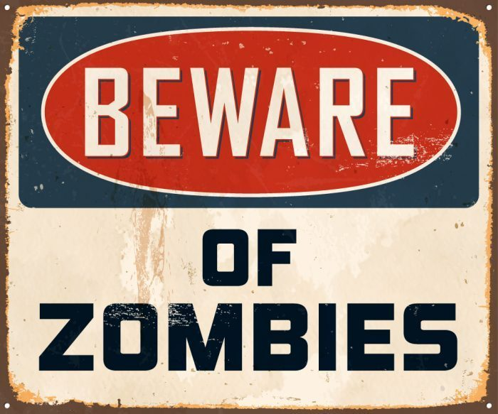
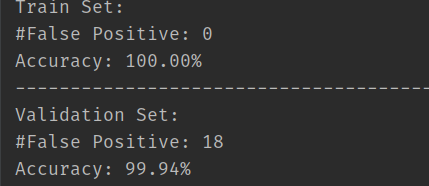

# What's the zombie enterprise?
Zombie enterprises refer to those enterprises that lack profitability but can obtain credit resources at a cost lower than the optimal interest rate in the market, and rely on external blood transfusion and lack viability. The existence of zombie enterprises destroys the market mechanism, aggravates the mismatch of credit resources, brings serious overcapacity problems, and also produces investment crowding out effect for other non zombie enterprises. In addition, due to the imperfection of China's financial system, zombie enterprises tend to adopt the informal financing mode of business credit between enterprises, which will bring "infection" to zombie enterprises' cooperative affiliated enterprises and even drag the banks to become "zombie banks". If zombie enterprises cannot be disposed in time, the transformation of economic momentum and high-quality development will not be guaranteed, and the blocking of deleveraging will increase systemic financial risks.

# How to recognize zombie enterprise?
The identification standards of zombie enterprises mainly include **official standards, chk standards and FN standards-Chk standard and various fn-chk amendment standards**, etc. the official standard is defined as enterprises that do not meet the national standards of energy consumption, environmental protection, quality, safety, etc., have sustained losses for more than three years and do not meet the direction of structural adjustment; enterprises that have been shut down, semi shut down, consecutive years of losses, and are unable to pay debts rely on government subsidies and bank loans to maintain their operations. The core of the chk standard is whether the enterprise accepts credit subsidies. The fn-chk standard contains the "true profit principle" and "evergreen loan principle". Most of the relevant FN-chk correction methods are to amend the above two standards, adjust the enterprise profit and asset liability ratio and other indicators, and introduce the enterprise's operating and management costs, net asset level, enterprise efficiency and innovation and other indicators In the identification standard system of zombie enterprises, we try to reflect the management characteristics of zombie enterprises from a more multidimensional level.

# What did we do?
For given multidimensional level data set, our group have try 3 different models to classification the zombie enterprise. The models include:
1. **Traditional machine learning**. We make a lot effort in model ensemble in order to make a complex but high performance model.
2. **Deep learning**. As we all know, the deep learning can do an auto feature engineering for us. In order to avoid forgotten features, we use neural network to extrack features.
3. **Magic trick**. In EDA procedure, I surprisely find a combination of features that can achieve a very high procedure. And this model is the final model our team selected.

Since this competition is ranked by accuracy. Here we only list the number of false positive and accuracy. This model may have room for improvement. But we do not intent to do it, because this model is already perfect. **Whether it is from the model complexity, interpretability, or inference speed, it can almost be asserted that this is the best model.**

Here is the result, you can see it easily by execute [this script](https://github.com/Sh-Zh-7/zombie-enterprise-recognition/blob/master/MagicTrick/magic.py).

# How?

I think maybe the labeling of this data set may be **just based on the tax value**. In fact, if you use a supervised method, just use the method used when labeling. There is no need to use data from other dimensions to infer.

# Dev Group

Sort by name in lexicographical order.

The **off-line training** is made by

-  [Lotherxuan](https://github.com/Lotherxuan)
-  [ShZh7](https://github.com/Sh-Zh-7)

The **on-line deployment** and **the development of web front-end and back-end** is by

- Yuning Wu

Guidance from **economics students**:

- Jiacheng Wang
- Yichi Zhang

# LICENSE

[MIT License](https://github.com/Sh-Zh-7/zombie-enterprise-recognition)

Copyright (c) 2020 sh-zh-7
